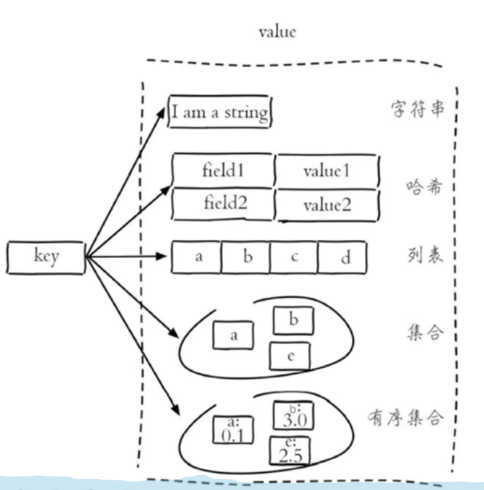
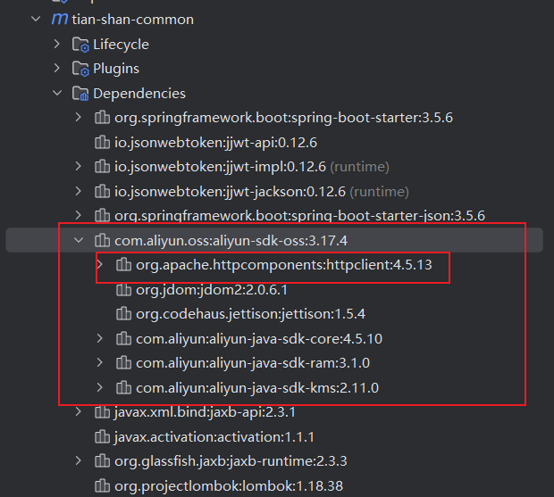
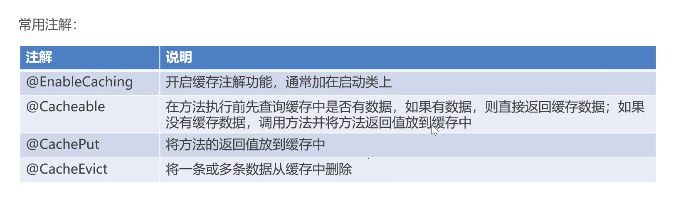
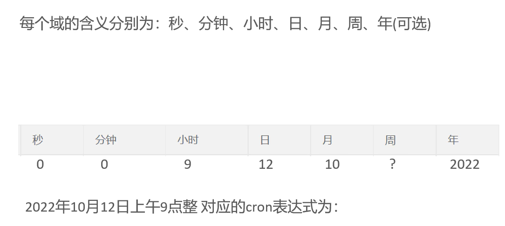
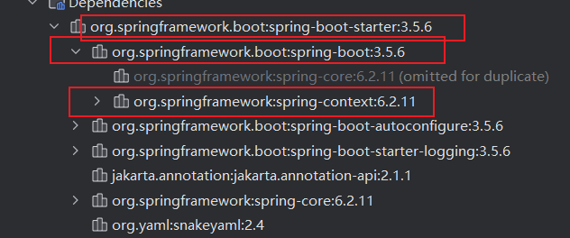
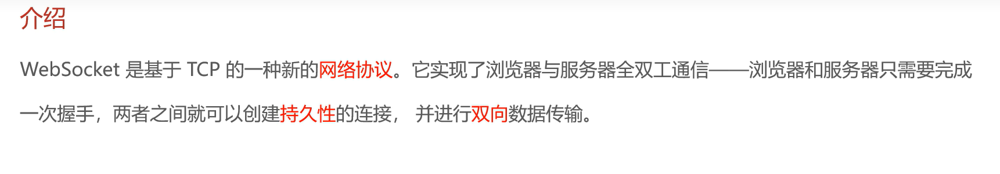

# 后端学习

## 一、公共字段自动填充

### 1.通过AOP实现

**思路：**

| 序号 | 字段名         | 含义    | 数据类型     | 操作类型(service层方法名) |
|----|-------------|-------|----------|-------------------|
| 1  | create_time | 创建时间  | datetime | insert            |
| 2  | create_user | 创建人id | bigint   | update            |
| 3  | update_time | 更新时间  | datetime | insert, update    |
| 4  | update_user | 更新人id | bigint   | insert, update    |

**实现方法：**

1. 自定义注解`AutoFill`，用于标识需要自动填充的方法
2. 自定义切面类`AutoFillAspect`，统一拦截有`AutoFill`注解的方法，通过反射给公共字段赋值
3. 在service层方法上添加`@AutoFill`注解，标识需要自动填充的公共字段

**技术点：**

- 枚举
- 注解
- AOP切面编程
- 反射

**统一做个约定：**

Controller层中调用的Service层方法update，insert的参数都是entity对象，比如EmployeeController中调用的update，service层方法的参数是Employee。


### 2.通过mybatis-plus的metaobjecthandler实现

具体方法可以参考：https://baomidou.com/guides/auto-fill-field/#2-%E5%AE%9E%E7%8E%B0-metaobjecthandler

## 二、git排除敏感信息

**思路：**
1. 从暂存区中删除该文件，保留工作区中的文件
   git rm --cached [文件名]</br>
   比如，在根目录下执行：
```bash
git rm --cached tian-shan-server/src/main/resources/application-dev.yml
git rm --cached tian-shan-server/src/main/resources/application-prod.yml
```
2. 然后把该文件添加到.gitignore文件中</br>
   比如：
```bash
### 忽略所有自定义环境配置文件 ###
/tian-shan-server/src/main/resources/application-*.yml
```
3. 把所有修改添加到暂存区：
   `git add -A`
4. 重新进行commit：
   `git commit -m '停止跟踪某个文件'`

## 三、mybatis-plus学习

### 1. 统一管理mybatis-plus和其插件的版本

官方文档：https://baomidou.com/getting-started/install/#maven-bom

比如：

```xml
<!--统一管理mybatis-plus的版本，包括插件，然后不用单独管理版本-->
<dependency>
    <groupId>com.baomidou</groupId>
    <artifactId>mybatis-plus-bom</artifactId>
    <version>${mybatis-plus-bom}</version>
    <type>pom</type>
    <scope>import</scope>
</dependency>
```

### 2.主键回填到对象里

官方文档：https://baomidou.com/reference/question/#insert-%E5%90%8E%E5%A6%82%E4%BD%95%E8%BF%94%E5%9B%9E%E4%B8%BB%E9%94%AE

比如：
```java
dishMapper.insert(dish);

// 执行完insert后，mybatis-plus自动把主键填充到entity对象中
Long dishId = dish.getId();
```

## 四、spring-doc配置踩坑记录

spring-doc文档1：https://springdoc.cn/spring-rest-openapi-documentation/

spring-doc文档2：https://juejin.cn/post/7475675805390323763

我无论怎么样，页面swagger-ui始终像是下面的这段英文：
```text
Unable to render this definition
The provided definition does not specify a valid version field.

Please indicate a valid Swagger or OpenAPI version field. 
Supported version fields are swagger: "2.0" 
and those that match openapi: 3.x.y (for example, openapi: 3.1.0).
```

最终通过这位兄弟的文章，解决了这个问题：https://juejin.cn/post/7377230203153727498

<mark>
但是注意，只要WebMvcConfigurer中其它消息转换器的优先级不等于0，swagger-ui就可以正常工作。
</mark>


## 五、Redis学习

中文官网：https://www.redis.net.cn/

数据类型：



redis的java客户端很多，最常用的几种：

-   Jedis
-   Lettuce
-   Spring Data Redis

```xml
<dependency>
    <groupId>org.springframework.boot</groupId>
    <artifactId>spring-boot-starter-data-redis</artifactId>
    <version>3.5.4</version>
</dependency>
```

```yml
spring:
  data:
    redis:
      host: localhost
      port: 6379
      password: ""
      database: 0   # 对应DB0数据库，默认就是0
```

**为什么要配置redis的Key序列化器：**

Redis 本身只能存储 **二进制数据**，不能直接理解 Java 对象。如果不配置序列化：

-   存进去的 key/value 是二进制乱码，不直观。

-   存储空间大（因为 JDK 序列化臃肿）。

比如：

```java
ValueOperations<String, Object> ops = redisTemplate.opsForValue();
ops.set("user:1", new User(1L, "Akbar"));
```

如果没配置序列化器，Redis 里看到的 key/value 是一堆二进制乱码，不是 `user:1` → `{id:1,name:Akbar}`。

配置示例：

```java
@Configuration
public class RedisConfig {

    @Bean
    public RedisTemplate<String, Object> redisTemplate(RedisConnectionFactory connectionFactory) {
        RedisTemplate<String, Object> template = new RedisTemplate<>();
        template.setConnectionFactory(connectionFactory);

        // key 采用 String 序列化
        template.setKeySerializer(new StringRedisSerializer());
        template.setHashKeySerializer(new StringRedisSerializer());

        // value 采用 JSON 序列化
        GenericJackson2JsonRedisSerializer jsonSerializer = new GenericJackson2JsonRedisSerializer();
        template.setValueSerializer(jsonSerializer);
        template.setHashValueSerializer(jsonSerializer);

        template.afterPropertiesSet();
        return template;
    }
}
```

## 六、httpClient

```xml
<!--httpClient-->
<dependency>
    <groupId>org.apache.httpcomponents</groupId>
    <artifactId>httpclient</artifactId>
    <version>4.5.14</version>
</dependency>
```

Apache HttpClient是客户端去主动发 HTTP 请求的工具。

现在项目里的 **后端 Controller** 是被动接收请求的。

但是有时候，我们的的后端服务也需要作为“客户端”，去调用别人家的接口，这时候就需要 `HttpClient` 或类似工具了。

<mark>注意：阿里云oss的：`aliyun-sdk-oss`已经使用了这个httpclient</mark>



## 七、SpringCache

```xml
<dependency>
    <groupId>org.springframework.boot</groupId>
    <artifactId>spring-boot-starter-cache</artifactId>
    <version>3.5.6</version>
</dependency>
```



## 八、定时任务SpringTask

**cron表达式：**



**注意：**周和日不能同时出现。

**cron表达式在线生成器：**https://cron.qqe2.com/


依赖：

```xml
<dependency>
    <groupId>org.springframework.boot</groupId>
    <artifactId>spring-boot-starter</artifactId>
</dependency>
```



在spring-context中就有spring-task。

## 九、WebSocket



maven坐标：

